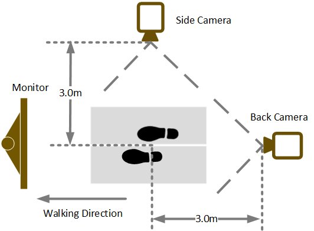
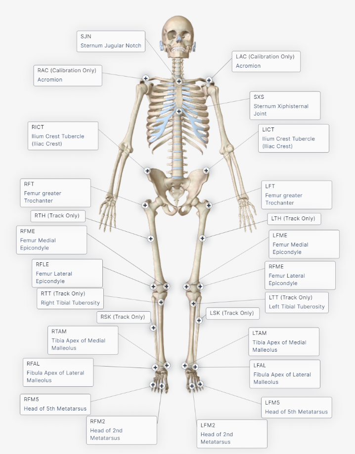
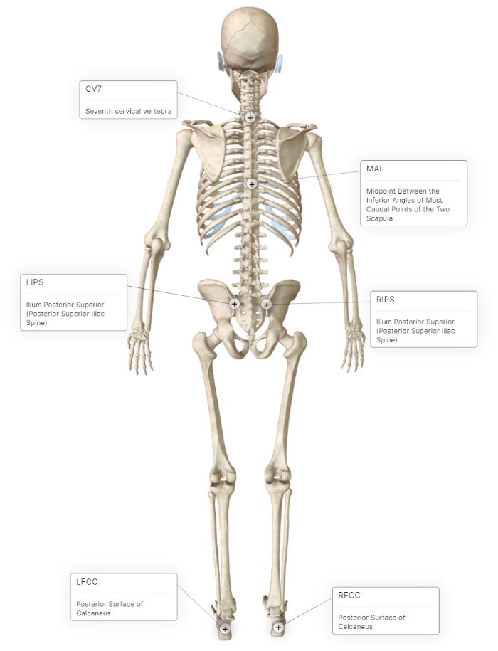

# IMU and Smartphone Camera Fusion for Knee Adduction and Knee Flexion Moment Estimation During Walking
By Tian Tan and Dianxin Wang

## Exclusive Summary
This repository includes the code and models for the paper submitted to IEEE Transactions on Biomedical Engineering.
When implementing our models, please place the cameras and IMUs according to [Hardware](#hardware)
and store the data according to [Data Format](#data-format).
An [example implementation](#running-example-code) is provided.

## Environment

### Software
Python 3.8; Pytorch 1.7.0; Cuda 11.0; Cudnn 8.0.4; matplotlib 3.3.2; numpy 1.19.4; h5py 3.0.0; Scikit-learn 0.23.2

Versions different from ours may still work.

### Hardware
#### Smartphone camera
iPhone 11 (Apple Inc., Cupertino, CA, USA)
were placed vertically on the right side (90 degree from walking direction)
and back of the subject (180 degree from walking direction) (see the figure below). 
The distance from treadmill center to each camera was 3m 
and the height from treadmill plane to each camera was 1.2m.

#### IMU
Eight SageMotion IMUs (SageMotion, Kalispell, MT, USA) were placed on each subject.
For each IMU, its z-axis is aligned with the body segment surface normal,
y-axis points upwards,
and x-axis being perpendicular to the y and z axes following the right-hand rule.

IMU anatomical locations: 

Segement name | Anatomical definition
:---: | ---
trunk | mid-point between sternum jugular notch and sternum xiphisternal joint
pelvis | mid-point between left and right anterior superior iliac spine
both thighs | mid-point between anterior superior iliac spine and femur medial epicondyle
both shanks | mid-point between femur medial epicondyle and tibia apex of medial malleolus
both feet | second metatarsal

#### Instrumented treadmill (for validation only)
Ground reaction force (GRF) and center of pressure (CoP) were collected with an instrumented treadmill 
with two split belts (Bertec Corp., Worthington, OH, USA).
CoP are calibrated with marker trajectories that the left-back corner was the origin of both force plates and optical motion capture.
The z-axis is aligned with the vertical direction pointing upwards,
y-axis is aligned with the walking direction
(in general aligned with anterior-posterior direction) pointing forwards,
and x-axis being perpendicular to the y and z axes following the right-hand rule
(in general aligned with medio-lateral direction).

#### Optical motion capture (for validation only)
32 reflective markers were placed on each subject and collected by an optical motion capture system
(Vicon, Oxford Metrics Group, Oxford, UK). Markers' corresponding body landmarks are visualized in the following figures.

## Data Format 
Each subject's data should be stored as a 3-dimensional matrix.
The first dimension is walking steps. The second dimension is
time step from heel-strike - 20 samples to toe-off + 20 samples. Both heel-strike and toe-off are detected using right
foot IMU data. Its length is 152, which is the lenghth of the longest step. Zeros were appended in the end of shorter
steps. The third dimension contains 256 data fields, which are described in the following section.

[example_data.h5](./trained_models_and_example_data/example_data.h5) is a correctly formatted example data file
containing 10 walking step of 2 subjects. The dimension of each subject's data is: 10 steps * 152 samples * 256 data fields.

### Data fields
#### Basic information

Field name | Explanation
:---: | ---
_force_phase_ | ground-truth stance phase
_body weight_ | weight of the subject, being constant for the whole step
_body height_ | height of the subject, being constant for the whole step

#### External knee moments
The external moments of the right knee were computed using cross product function [1]

Field name | Explanation
:---: | ---
_EXT_KM_X_ | external knee moment in sagittal plane, also known as knee flexion moment
_EXT_KM_Y_ | external knee moment in frontal plane, also known as knee adduction moment
_EXT_KM_Z_ | external knee moment in transverse plane

#### IMU data
IMU fields are named in the form of "Measurement(Axis)_Segment".

Measurement name | Explanation
:---: | ---
_Accel_ | acceleration
_Gyro_ | gyroscope
_Mag_ | magnetometer
_Quat_ | quaternion

Segments name | Explanation
:---: | ---
_L_FOOT_ | left foot
_R_FOOT_ | right foot
_R_SHANK_ | right shank
_R_THIGH_ | right thigh
_WAIST_ | pelvis
_CHEST_ | upper trunk
_L_SHANK_ | left shank
_L_THIGH_ | left thigh

#### Joints detected from camera data
Videos recorded by two smartphone cameras were processed by
<a href="https://github.com/CMU-Perceptual-Computing-Lab/openpose" target="_blank">OpenPose</a> [2], a body keypoint detection library,
a body keypoint detection library. 2D positions of left/right shoulders, left/right hip, mid-hip, left/right knees,
left/right ankles, and left/right heels detected by OpenPose's
<a href="https://github.com/CMU-Perceptual-Computing-Lab/openpose/blob/18de3a0010dd65484b3eb357b5c3679c9a2fdf43/doc/02_output.md" target="_blank">Body_25</a> model.

2D joint position fields are named in the form of "Joint_Axis_Camera".
For example, _LShoulder_x_90_ means pixel position (1080 pixel in total) of left shoulder joint in horizontal direction of right camera view.
_RShoulder_y_180_ means pixel position (1920 pixel in total) of right shoulder joint in vertical direction of back camera view.

#### Force plate and optical motion capture measurements
GRFs' and CoPs' field names are in the form of "plate_2_force/cop_Axis". Plate 2 corresponds to right foot.

Markers' field names are in the form of "MarkerName_Axis".

## Use KAM and KFM estimation models
### Trained models
Five types of models are provided:

(1) a fusion model based on eight IMUs and cameras
([KAM](./trained_models_and_example_data/8IMU_camera_KAM.pth), [KFM](./trained_models_and_example_data/8IMU_camera_KFM.pth))

(2) a fusion model based on three IMUs (pelvis and feet) and cameras
([KAM](./trained_models_and_example_data/3IMU_camera_KAM.pth), [KFM](./trained_models_and_example_data/3IMU_camera_KFM.pth))

(3) an eight-IMU-based model
([KAM](./trained_models_and_example_data/8IMU_KAM.pth), [KFM](./trained_models_and_example_data/8IMU_KFM.pth))

(4) a three-IMU-based model (pelvis and feet)
([KAM](./trained_models_and_example_data/3IMU_KAM.pth), [KFM](./trained_models_and_example_data/3IMU_KFM.pth))

(5) a camera-based model.
([KAM](./trained_models_and_example_data/camera_KAM.pth), [KFM](./trained_models_and_example_data/camera_KFM.pth))

### Running example code
An implementation ([a_load_model_and_predict.py](a_load_model_and_predict.py)) is provided
as an example of using the trained model.

## References
[1] D. J. Rutherford and M. Baker, “Knee moment outcomes using inversedynamics and the cross product function in 
moderate knee osteoarthritisgait: A comparison study,”Journal of Biomechanics, vol. 78, pp. 150–154, 2018.

[2] Z. Cao, G. Hidalgo Martinez, T. Simon, S. Wei, and Y. A. Sheikh,“Openpose: Realtime multi-person 2d pose estimation
using part affinityfields,”IEEE Transactions on Pattern Analysis and Machine Intelligence,vol. 43, no. 1, pp. 172–186,
2019

